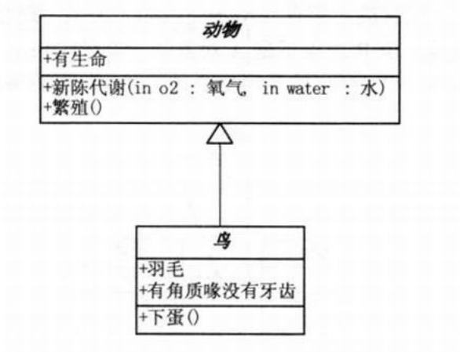
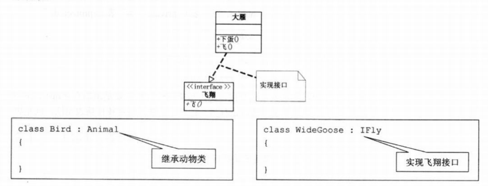
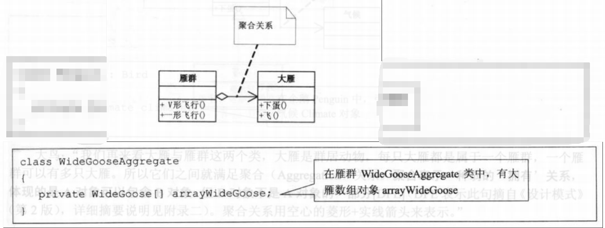

## 面试受挫

要求：用任意一种面向对象语音实现一个计算器控制台程序，要求输入两个数和运算符号，得到结果。

## 代码毛病

```c#
class Program
{
    static void Main(string[] args)
    {
        //命名不规范
        Console.Write("请输入数字A：");
        string A = Console.ReadLine();
        Console.Write("请选择运算符号（+、-、*、/）：");
        string B = Console.ReadLine();
        Console.Write("请输入数字B：");
        string C = Console.ReadLine();
        string D = "";

        //这样判断分支，意味着每个条件都要做判断，等于计算机做了三次无用功
        if (B == "+")
        {
            D = Convert.ToString(Convert.ToDouble(A) + Convert.ToDouble(C));
        }

        if (B == "-")
        {
            D = Convert.ToString(Convert.ToDouble(A) - Convert.ToDouble(C));
        }

        if (B == "*")
        {
            D = Convert.ToString(Convert.ToDouble(A) * Convert.ToDouble(C));
        }

        if (B == "/")
        {
            //除数时，如果用户输入了0怎么办，如果用户输入的时字符符号而不是数字怎么办
            D = Convert.ToString(Convert.ToDouble(A) / Convert.ToDouble(C));
        }

        Console.WriteLine("结果是：" + D);
    }
}
```

## 代码规范

```c#
class Program
{
    static void Main(string[] args)
    {
        try
        {
            Console.Write("请输入数字A：");
            string strNumberA = Console.ReadLine();
            Console.Write("请选择运算符号（+、-、*、/）：");
            string strOperate = Console.ReadLine();
            Console.Write("请输入数字B：");
            string strNumberB = Console.ReadLine();
            string strResult = "";

            switch (strOperate)
            {
                case "+":
                    strResult = Convert.ToString(Convert.ToDouble(strNumberA) + Convert.ToDouble(strNumberB));
                break;
                case "-":
                    strResult = Convert.ToString(Convert.ToDouble(strNumberA) - Convert.ToDouble(strNumberB));
                break;
                case "*":
                    strResult = Convert.ToString(Convert.ToDouble(strNumberA) * Convert.ToDouble(strNumberB));
                break;
                case "/":
                    if (strNumberB != "0")
                    {
                        strResult = Convert.ToString(Convert.ToDouble(strNumberA) / Convert.ToDouble(strNumberB));
                    }
                    else
                    {
                        strResult = "除数不能为0";
                    }
                break;
            }
            Console.WriteLine("结果是：" + strResult);
            Console.ReadLine();
        }
        catch (Exception ex)
        {
            Console.WriteLine("您输入的有错：" + ex.Message);
        }
        
    }
}
```

## 面向对象编程

所有编程初学者都会有这样的问题，就是碰到问题就直觉的用计算机能够理解的逻辑来描述和表达待解决的问题及具体的求解过程。但这样的思维却使得我们的程序值满足实现当前的需求，程序不易维护，不易扩展，更不容易复用。从而达不到高质量代码的要求。

## 活字印刷，面向对象

- 例子：
    - 喝酒唱歌，人生真爽
    - 对酒当歌，人生真爽
    - 对酒当歌，人生几何

1. 要改，只需更改要改的字，此为可维护。
2. 这些字并非用完这次就无用，完全可以在后来的印刷中重复使用，此为可复用。
3. 此诗若要加字，只需另刻字加入即可，此为可扩展。
4. 字的排列其实可能是竖排可能是横排，此时只需要将活字移动就可做到满足排列需求，此为灵活性好。

## 面向对象的好处
可以通过封装，继承，多态把程序的耦合度降低。用设计模式使得程序更加灵活，容易修改，并且易于复用。

## 复制 vs 复用
Ctrl + C 和 Ctrl + V ，这是非常不好的编码习惯，因为当代码中重复的代码多到一定程度，维护的时候，就是一场灾难。越大的系统，这种方式带来的问题越严重，编程有一个原则，就是用尽可能的办法去避免重复。

## 业务的封装

准确的说，就是让业务逻辑与界面逻辑分开，让它们之间的耦合度下降。只有分离开，才可以达到容易维护或扩展。

Operation运算类
```c#
public class Operation
{
    public static double GetResult(double numberA,double numberB,string operate)
    {
        double result = 0d;
        switch (operate)
        {
            case "+":
                result = numberA + numberB;
            break;
            case "-":
                result = numberA - numberB;
            break;
            case "*":
                result = numberA * numberB;
            break;
            case "/":
                result = numberA / numberB;
            break;
        }
        return result;
    }
}
```
客户端代码
```c#
static void Main(string[] args)
{
    try
    {
        Console.Write("请输入数字A：");
        string strNumberA = Console.ReadLine();
        Console.Write("请选择运算符号（+、-、*、/）：");
        string strOperate = Console.ReadLine();
        Console.Write("请输入数字B：");
        string strNumberB = Console.ReadLine();
        string strResult = "";
        strResult = Convert.ToString(Operation.GetResult(Convert.ToDouble(strNumberA),Convert.ToDouble(strNumberB),strOperate));
        Console.WriteLine("结果是：" + strResult);
        Console.ReadLine();
    }
    catch (Exception ex)
    {
        Console.WriteLine("您的输入有错误：" + ex.Message);
    }
}
```

## 紧耦合 vs 松耦合

把加减乘除等运算符分离，修改其中一个不影响另外几个，增加运算算法也不影响其他代码。继承，多态

Operation运算类
```c#
public class Operation
{
    private double _numberA = 0;
    private double _numberB = 0;

    public double NumberA
    {
        get { return _numberA; }
        set { _numberA = value; }
    }

    public double NumberB
    {
        get { return _numberB; }
        set { _numberB = value; }
    }

    public virtual double GetResult()
    {
        double result = 0;
        return result;
    }
}
```
加减乘除类
```c#
class OperationAdd : Operation
{
    public override duble GetResult()
    {
        double result = 0;
        result = NumberA + NumberB;
        return result;
    }
}

class OperationSub : Operation
{
    public override duble GetResult()
    {
        double result = 0;
        result = NumberA - NumberB;
        return result;
    }
}

class OperationMul : Operation
{
    public override duble GetResult()
    {
        double result = 0;
        result = NumberA * NumberB;
        return result;
    }
}

class OperationDiv : Operation
{
    public override duble GetResult()
    {
        double result = 0;
        if (NumberB == 0)
        {
            throw new Exception("除数不能为0");
        }
        result = NumberA / NumberB;
        return result;
    }
}
```

如何让计算机知道我们希望用哪一个算法呢？

## 简单工厂模式

接上例，到底要实例化谁，将来会不会增加实例化对象，比如增加开根运算，这是很容易变化的地方，应该考虑用一个单独的类来做这个创造实例的过程，这就是工厂。

```c#
public class OperationFactory
{
    public static Operation CreateOperate(string operate)
    {
        Operation oper = null;
        switch (operate)
        {
            case "+":
            oper = new OperationAdd();
            break;
            case "-":
            oper = new OperationSub();
            break;
            case "*":
            oper = new OperationMul();
            break;
            case "/":
            oper = new OperationDiv();
            break;
        }
        return oper;
    }
}
```
只需要输入运算符号，工厂就实例化出合适的对象，通过多态，返回父类的方式实现了计算器的结果。

```c#
Operation oper;
oper = OperationFactory.CreateOperate("+");
oper.NumberA = 1;
oper.NumberB = 2;
double result = oper.GetResult();
```

## UML类图

### 类


- 动物是矩形，代表一个类（class）。类图分三层。
  -  第一层显示类的名称，如果是抽象类，用斜体显示。
  -  第二层是类的特性，通常就是字段和属性。
  -  第三层是类的操作，通常是方法或行为。注意前面的符号，‘+’ 表示 public ,‘-’ 表示private，‘#’ 表示protected。


### 接口

- 左下角的‘飞翔’，它表示一个接口图，与类图的区别主要是顶端有<<interface>>显示。
  - 第一行是接口名称。
  - 第二行是接口方法。

- 接口还有另外一种表示方法，俗称棒棒糖表示法。


接下来就是类与类，类与接口之间的关系。

### 继承关系

- 继承关系用空心三角形 + 实线来表示。



### 接口实现

- 实现接口用空心三角形 + 虚线来表示。大雁实现了飞翔的接口。


### 关联

- 当一个类‘知道’另一个类时，可以用关联（association）。
- 关联关系用实线箭头来表示。
- 企鹅和气候两个类，企鹅时很特别的鸟，会游不会飞。更重要的是，它与气候有很大的关联。


### 聚合

- 聚合表示一种弱的‘拥有’关系，体现的是A对象可以包含B对象，但B对象不是A对象的一部分。
- 聚合关系用空心的菱形 + 实线箭头来表示。
- 大雁与雁群这两个类，大雁是群居动物，每只大雁都是属于一个雁群，一个雁群可以有多只大雁。所以它们之间满足聚合（Aggregation）关系。



### 合成

- 合成（Composition，也有翻译成‘组合’的）是一种强的‘拥有’关系，体现了严格的部分和整体的关系，部分和整体的生命周期一样。
- 鸟和其翅膀就是合成（组合）关系，因为它们是部分和整体的关系，并且翅膀和鸟的生命周期是相同的。
- 合成关系用实心的菱形 + 实线箭头来表示。
- 合成关系的连线两端还有一个数字‘1’和数字‘2’，这被称为基数。表明这一端的类可以有几个实例，很显然，一个鸟应该有两只翅膀。如果一个类可能有无数个实例，则用‘n’来表示。关联关系、聚合关系也可以有基数。


### 依赖关系

- 依赖关系（Dependency）用虚线箭头来表示。
- 动物依赖于氧气和水。


编程是一门技术，更加是一门艺术，不能只满足于写完代码运行结果正确就完事，时常考虑如何让代码更加简练，更加容易维护，容易扩展和复用，只有这样才可以真正得到提高。


